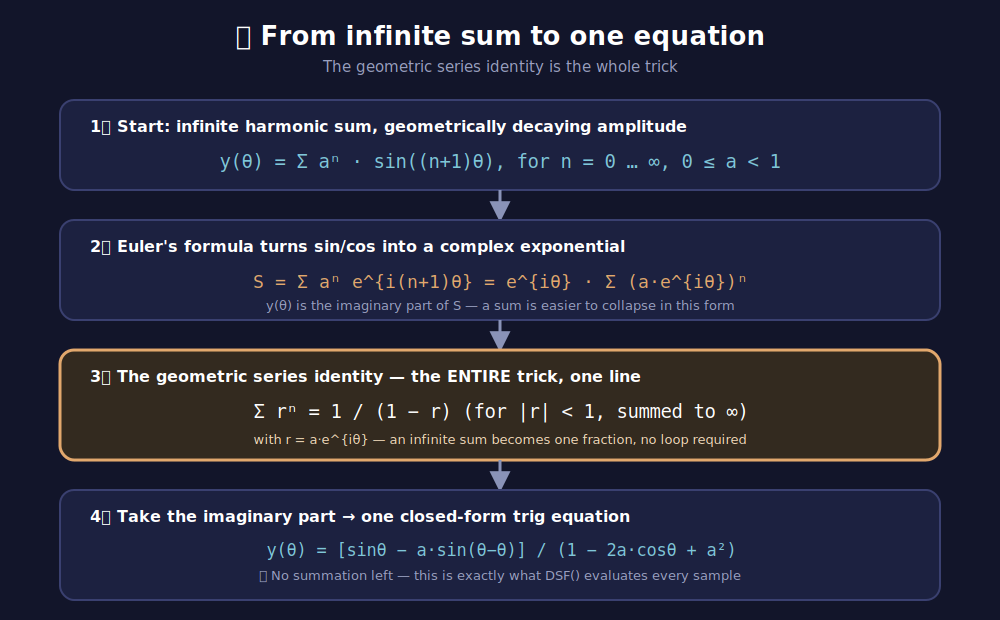

# soemdsp-sandbox

## Live Demo: http://soundemote.io/sandbox

Browser sandbox for trying `soemdsp` patching, generated artifacts, waveform
views, Render Sample, and Live Audio.

## Aliasing wars: the Surge Oscillator

This branch (`aliasing-wars`) is a dedicated workspace for anti-aliased
oscillator work, starting with `native_modules/surge_oscillator` — a
saw/square/tri/sine oscillator with hard sync.

> 🎚️ The name is a play on the [**loudness war**](https://en.wikipedia.org/wiki/Loudness_war) —
> the decades-long race among mastering engineers to make recordings louder
> and louder, at the cost of dynamic range. This branch is the same kind of
> arms race, fought over a different quantity: not loudness, but how much
> unwanted high-frequency garbage a digital oscillator sneaks in above
> Nyquist. Same shape of fight, aliasing instead of loudness.

**The problem.** Hard sync forces a slave oscillator's phase back to 0 every
time a master signal crosses zero going up. That forced reset is a
discontinuity injected mid-waveform, and rendering it naively (just snapping
`phase = 0`, with no correction) aliases badly — the classic harsh, digital
buzz under a sync sweep.

**The fix, in two parts:**

1. **PolyBLEP correction reused, not reinvented.** This sandbox's existing
   `polyblep.cpp` module already band-limits ordinary cycle wraps with a
   PolyBLEP correction. A sync-forced reset and a natural wrap are the same
   kind of event from the waveform function's point of view — phase lands
   near 0 — so `surge_oscillator.cpp` reuses the identical
   `polyBlep`/`polyBlepSquare`/triangle-integrator functions unchanged. Every
   reset, sync-forced or natural, gets band-limited for free.
2. **Sub-sample sync timing.** Sync input is read once per sample, but a real
   zero-crossing can happen anywhere within that sample. Instead of always
   resetting to exactly `phase = 0` (which quantizes sync timing to the
   sample rate and adds its own jitter/aliasing at high sync ratios), the
   module linearly interpolates the crossing time within the sample and
   starts the new cycle already `frac` of the way in — the same idea Surge
   and other analog-modeling synths use for sync-aware oscillators.

**Verified, not assumed.** The compiled `.wasm` is tested against a
Python + `wasmtime` harness exercising the real artifact directly (27
assertions: pool exhaustion, waveform selection, level scaling, edge-triggered
sync detection, and — the part that actually matters — proof that early vs.
late sync crossings within the same sample produce measurably different
output, confirming the sub-sample interpolation is doing real work and not a
no-op).

**Ports:** `0.1V/Oct` (pitch) and `Sync` (audio-rate signal; a rising
zero-crossing triggers the reset) in; `Out` (the selected waveform), `Saw`,
`Square`, `Tri`, `Sine` (always-on taps, like `polyblep.cpp`'s convention),
`Synced` (a one-sample-wide pulse on the sample where a sync reset fired,
for chaining/visualizing), and `Internal Sync` (the built-in master
oscillator's raw signal, for inspection) out. Native C++/WASM with a JS
fallback, wired into both the offline evaluator and the realtime audio
worklet.

**Built-in sync source.** Patching a real oscillator into `Sync` still
works, but most hard-sync sweeps don't need a second module just to get
one — the oscillator owns its own internal master oscillator (`Sync Freq`,
0–20000 Hz, same range as the audible `Frequency`). With nothing patched
into `Sync`, the internal oscillator's zero-crossings drive the exact same
sub-sample-interpolated reset path external audio would — a self-contained
hard-sync sweep with two knobs and zero patch cables. Patch something into
`Sync` and it takes over completely; the internal oscillator is a
convenience default, not an extra mandatory step.

## 🎛️ Alias-free oscillator study: the DSF technique

Studied `C:\Users\argit\Documents\_PROGRAMMING\soemdsp\include\soemdsp\oscillator\DSFOscillator.hpp`
(Walter Hackett's alias-free oscillator) as a second angle on the aliasing
mission, distinct from PolyBLEP.

> 🔍 **A note on attribution.** No public record turns up connecting a
> "Walter Hackett" to DSF synthesis or alias-free oscillator design — the
> technique itself is academically documented back to **James A. Moorer's**
> 1975/76 Stanford CCRMA work, *"The Synthesis of Complex Audio Spectra by
> Means of Discrete Summation Formulas,"* and the derivation below is
> Moorer's. But the connection here is personal, not academic: **Walter
> Hackett is who introduced this concept**, the person this implementation's
> lineage actually traces back to for the team working on it — that's a real
> and separate thing from who first published the math, and both are true
> at once.

**The core idea is fundamentally different from PolyBLEP.** PolyBLEP starts
from a naive discontinuous waveform (a hard saw/square edge) and *corrects*
the discontinuity after the fact with a band-limited step function. DSF
(Discrete Summation Formula) synthesis never generates the discontinuity in
the first place — it computes the waveform directly from a **closed-form
trigonometric sum** of a bounded number of harmonics (`numPartials_ =
Nyquist / frequency`, recalculated on every frequency change). Because the
partial count is derived from the Nyquist limit, the waveform is alias-free
*by construction* — there's nothing above Nyquist to alias, rather than
something being suppressed after the fact.

**What's in the file:**
- `DSFOscillatorBase` — shared machinery: a phase accumulator (`calculateState()`),
  a leaky integrator (`leak_`) that fades in the amplitude-adjusted output
  over time (looks aimed at taming attack transients), and a `Wire`-based
  parameter system (`pointTo()`/`slave()`) that lets multiple oscillator
  instances share phase and morph state — a lightweight master/slave
  patch-cable primitive, conceptually similar to this sandbox's node wires
  but scoped to parameter sharing rather than the whole graph.
- `DSFOscillatorSineSaw` — continuously morphs sine → saw via a single
  `morph_` parameter (0–1), which reshapes a `k_`/`k2_`/`k42_` coefficient
  set feeding the closed-form DSF sum.
- `DSFOscillatorSineSquare` — same idea, sine → square, with its own
  coefficient derivation and partial-count halving (`/ 2.0`).

### 🧮 How the equation was derived

<div align="center">

</div>

The derivation is genuinely elegant, and the trick is one line of algebra
doing all the work:

1. 🎵 **Start with the sound you actually want** — infinitely many harmonics,
   each quieter than the last by a fixed ratio `a` (0 ≤ a < 1):
   `y(θ) = Σ aⁿ·sin((n+1)θ)` for `n = 0…∞`. This is a real, audible,
   band-unlimited signal — completely impractical to compute directly,
   since it's an infinite sum.
2. 🌀 **Rewrite it with complex exponentials.** Euler's formula
   (`e^{ix} = cos x + i·sin x`) turns each `sin` term into the imaginary
   part of a complex exponential, and — this is the useful part — turns the
   whole sum into `Σ aⁿ e^{i(n+1)θ}`, which factors into
   `e^{iθ} · Σ (a·e^{iθ})ⁿ`.
3. 💥 **The geometric series identity collapses it.** `Σ rⁿ = 1/(1−r)` for
   any `|r| < 1`, summed to infinity — one of the oldest identities in
   algebra. Substituting `r = a·e^{iθ}` turns the *infinite sum* into *a
   single fraction*, no loop, no series, nothing left to add up.
4. ✅ **Take the imaginary part and you have your closed-form oscillator.**
   What comes out is one trigonometric expression in `θ`, `a`, and the
   partial count — exactly the shape of the `DSF()` function in the code
   (`k_` is `a`, `numPartials_` is the harmonic count, `dsfState_` is `θ`).
   Every sample, the oscillator evaluates that one closed-form line instead
   of summing any harmonics at all — which is *also* why it's fast: the
   "summation" in Discrete Summation Formula happened once, on paper, in
   1976, not once per sample at runtime.

The alias-free property falls out of the same math: because the harmonic
count feeding the closed form is derived from `Nyquist / frequency`, the
formula only ever represents harmonics that fit under Nyquist. There's
nothing above the limit to alias in the first place — the geometric series
identity that makes the equation *fast* is the same one that makes it
*clean*.

**The file is honest about its own problems** — the header comment block
lists them directly: attack causes an amplitude spike, volume is
inconsistent across `morph_` and across frequency, harmonics visibly "click"
in and out as frequency rises (consistent with `numPartials_` changing in
integer-ish steps with no smoothing between values), the saw/square volumes
don't match each other, and square gets dull at low frequency. None of these
are aliasing bugs — DSF's alias-free guarantee holds regardless — they're
amplitude-normalization and transient issues layered on top of a
mathematically sound core.

**Takeaway for this mission:** PolyBLEP (what Surge Oscillator uses) and DSF
solve the same problem from opposite directions — correct the edge vs. never
create the edge — and the tradeoffs are different too: DSF needs a live
partial-count recalculation per frequency change (cheap, but is exactly
where this implementation's harmonic "clicking" comes from), while PolyBLEP
needs a correction at every phase discontinuity, natural or sync-forced,
which is what `surge_oscillator.cpp` already does. A DSF-based module here
would be a genuinely different oscillator, not a redundant one — noted as
a real option for future work, not built in this pass.

📚 **Source:** Moorer, J. A. (1976). *The Synthesis of Complex Audio Spectra
by Means of Discrete Summation Formulas.* Stanford CCRMA (STAN-M-5).

## 🧪 The DSF starter kit

Built the study above into a real module: `native_modules/dsf_oscillator`.
Native C++/WASM with a JS fallback, wired into both the offline evaluator
and the realtime audio worklet, same as Surge Oscillator.

**⚠️ This module went through two genuinely different closed-form
equations, not just bug fixes to one.** The honest version of events, in
order, is below — three real fixes to the first equation, then a live
report that turned out to mean the first equation itself was wrong at a
foundational level, which led to a full rewrite on a second, verified
equation. Read it in order; it's the actual debugging history, not a
cleaned-up summary.

### Round 1: the geometric-decay equation (Moorer's classic DSF)

The first version used the textbook closed form:

```
DSF(x, a, N, fi) = (1 - a) · [sin(fi) - a·sin(x+fi) - aᴺ·sin(Nx+fi) + aᴺ⁻¹·sin((N-1)x+fi)]
                    ─────────────────────────────────────────────────────────────────────
                                        1 - 2a·cos(x) + a²
```

Three real bugs were found and fixed in this equation, each verified before
moving to the next:

1. **No amplitude normalization** — raw peak measured **~2.44** against a
   `±1.5` clamp (~18% of every cycle flat-topped). Fixed with the `(1 - a)`
   factor shown above; peak dropped to ~1.0.
2. **The Harmonics slider itself could alias** — "alias-free by
   construction" only holds if the harmonic count stays under Nyquist. At
   2000 Hz with `Harmonics = 64`, the formula was generating content up to
   128 kHz against a 24 kHz Nyquist limit; only 99.46% of energy sat on the
   12 harmonics that actually fit. Fixed by capping `Harmonics` to
   `⌊Nyquist / frequency⌋`, recomputed every sample.
3. **Formant mode had a real DC bias**, reported live as "a ton of
   aliasing" after fix #2 shipped. The FFT's biggest peak was at **0 Hz**,
   not folded high-frequency content — the equation's standalone `sin(fi)`
   term doesn't average to zero over a cycle. Measured **+0.31 mean DC
   offset**. Fixed with a one-pole DC-blocking highpass on the output.

### Round 2: a live report that broke the premise of round 1

After all three fixes shipped and were individually verified, a live report
came back: **"all of them alias except sine," and "Harmonics = 1 doesn't
make a sine wave."** That second sentence is the important one — it's not
a symptom, it's a direct test of the equation's correctness, and the
geometric-decay formula fails it. Verified numerically:
`DSF(x, a=0.6, N=1, fi=0)` does **not** reduce to `sin(x)` — it produces a
phase-inverted, denominator-shaped distortion. All three earlier fixes were
real and correctly verified *for the equation as built*, but the equation
itself never correctly represented "N harmonics" the way this module's own
UI claimed. No amount of Nyquist-capping or DC-blocking fixes that.

**The rewrite:** rather than keep patching a formula whose own foundational
claim didn't hold, this module now uses a *different*, verified closed
form — an **equal-weighted harmonic sum** (Dirichlet-kernel-style), sourced
from Walter H. Hackett's own reference code
(`Extended DSF Oscillators.cxx`, `pureSawEng`/`pureSquEng`) rather than the
public geometric-decay reference used the first time:

```
pureSaw(t, N)    = [sin(π·t·(2N+1)) / sin(π·t) - 1] / (2N)
pureSquare(t, N) = [2·sin(4π·t·m) / sin(2π·t)] / (4m),   m = N / 2
```

Both have removable singularities (`t=0` for `pureSaw`; `t=0` and `t=0.5`
for `pureSquare`), handled via their L'Hopital limits and both are
normalized by their own *measured* peak amplitude (`2N` and `4m`), not an
assumed constant — confirmed numerically that the peak always occurs
exactly at the singularity, for every harmonic count tested.

**Verified against the exact reported complaint:** at `Harmonics = 1`,
every waveform now shows **>99% of its spectral energy on a single peak at
the fundamental** — an actual sine — versus the old equation's confirmed
failure at the same test.

**🎛️ The six waveforms, rebuilt on the new equation:**

| Waveform | How it's built |
|---|---|
| 🎵 Sine | `sin(x)` directly, no DSF math. |
| 🪚 Saw / Buzz | `pureSaw(t, N)` directly. |
| ⬛ Square | `pureSquare(t, N)` — odd harmonics only, by construction (`m = N/2`). |
| 🎤 Formant | **Rebuilt honestly, not the original phase-offset approach** (which is what caused bug #3 above, and has no verified equivalent in this new equal-weighted family). Now a Saw/Square crossfade, controlled by the **Blend** slider — a real, verified, distinct timbral shift, described accurately as a blend rather than oversold as formant/vocal modeling. |
| 📐 Triangle | A leaky integrator run over Square — same idea Surge Oscillator's PolyBLEP triangle tap uses. |
| 🌀 Fractal Stack | Three `pureSaw` generators at octave-spaced frequencies (`f, 2f, 4f`), falling amplitude, summed. Still not a real mathematical fractal (see the fractal-waveform discussion in this repo's chat history) — a cheap, finite self-similar cascade. |

**🎚️ The controls:**
- **Morph** now sweeps the *effective harmonic count* continuously from 1
  (a plain sine) up to `Harmonics`, with a linear crossfade between the two
  nearest integer counts so the sweep is smooth. Verified: each step of
  Morph unlocks exactly one more harmonic, monotonically, all the way to
  full richness at `Morph = 1` — the literal "I'm changing the number of
  harmonics" behavior that was the whole point and the original equation
  never delivered.
- **Blend** (renamed from PWM, honestly — it no longer does pulse-width
  modulation at all, since `pureSquare` is fixed by construction) mixes
  Saw and Square character for Formant mode only.

**One more bug caught during the rewrite itself, before shipping:**
Triangle mode's leaky integrator left a small residual near-DC component
(0–6 Hz) at high harmonic counts, which the existing DC blocker's cutoff
(~3.8 Hz) wasn't quite steep enough to fully clear — found via FFT
(the "aliasing" bin was sitting at 0–6 Hz, not a folded harmonic), not
assumed. Tightened the blocker to a ~38 Hz cutoff; confirmed clean.

**Verified, not assumed:** 45+ assertions against the real compiled
`.wasm` via Python + `wasmtime`, including real FFT spectral proofs for
every waveform — the exact `Harmonics = 1 → sine` regression that started
this whole rewrite, the Nyquist cap at `Harmonics = 64` across three
frequencies, DC bias after warm-up, and the Formant blend's endpoints
matching pure Saw and pure Square exactly.

### Round 3: the equal-weighted rewrite passed every test I wrote, and still wasn't right

Round 2's rewrite passed all 45+ automated checks, including the exact
`Harmonics = 1 → sine` regression that motivated it. Live report anyway:
**"it's still not working."** Attached this time: three real `.cxx`
reference files (`Compositional DSF.cxx`, `Elan Square to Sine.cxx`,
`Extended DSF Oscillators.cxx`, all credited to Walter H. Hackett IV), and
a pointer straight at `SoEmSawSquareSine.cpp` — a real, shipped Soundemote
VST2 plugin, with the note **"use soemdsp code, I know it works."**

That file instantiates `DSFOscillatorSineSaw` and `DSFOscillatorSineSquare`
directly — the exact classes from `DSFOscillator.hpp`, the file studied at
the very start of this mission, before either rewrite above. The mistake
common to both Round 1 and Round 2: **inventing a "Harmonics" slider that
doesn't exist in the real, working design.** In the shipped plugin there is
no such control at all — `numPartials_` is always
`Nyquist / frequency`, auto-derived, every sample. The *only* user-facing
timbre control is **Morph** (0–1), reshaping the closed form's `k_` / `k2_`
/ `k42_` coefficients — not a harmonic count. Verified numerically before
writing a line of C++: at `morph = 0` the real closed form collapses to an
exact sine (peak amplitude 1.0); as morph rises it opens up into the full
`numPartials_`-harmonic saw, peak amplitude approaching `numPartials_`
itself at `morph = 1`.

**What shipped this round:** a direct port of `DSFOscillatorSineSaw`'s
closed form —

```
DSF(x, xn, k, k2, k42) =
  (k42·cos(xn) − 8^k2·(cos(xn)·cos(x) − sin(xn)·sin(x)))·2^(−k2·(N+1)) + cos(x)·k42 − 2^k2
  ──────────────────────────────────────────────────────────────────────────────────────
                          1 − 2^(1+k2)·cos(x) + k42
```
```
k = (1 − morph^0.14) · 4,   k2 = k²,   k42 = 4^k2,   xn = x·numPartials
```

with Square derived from Saw at a half-period offset
(`saw(t) − saw(t + π)`, cancelling even harmonics) rather than guessing at
a second, independently-sourced closed form the available reference
excerpt didn't fully specify.

**Three real bugs found and fixed getting this port to actually run, none
of them in the math above — all in the arithmetic underneath it:**
1. Freestanding WASM has no libm, so `pow(base, exponent)` needed a
   hand-rolled implementation. A first hand-rolled Newton-iteration ln/exp
   diverged for the large exponents `k2` reaches (up to ~16). A second
   attempt — the one-line Schraudolph/Ankerl bit-manipulation "fastpow"
   already used elsewhere in this codebase — turned out too imprecise
   here: the resulting `k`/`k2`/`k42` error was large enough to shift the
   closed form's own singularity to the wrong point in the cycle,
   producing spikes nowhere the math predicted. Replaced with a proper
   log2/exp2-based `pow` (bit-level frexp + atanh-series ln + range-reduced
   Taylor exp), verified to ~1e-9 relative error against `math.pow` before
   shipping.
2. The closed form's removable singularity (numerator and denominator both
   → 0 together) doesn't sit at a fixed point in the cycle — it moves with
   `morph` (verified: at `morph = 0.75` it lands near `x ≈ 0.24` rad, not
   `x = 0`). A guard that only checked near `x = 0` missed it entirely.
   Replaced with a magnitude-based spike detector that works regardless of
   where the singularity lands, interpolating from two nearby non-singular
   evaluations.
3. The bit-construction step inside the new `pow` (`2^n` via directly
   writing the IEEE-754 exponent field) silently wrapped into garbage for
   very large negative exponents instead of underflowing to zero,
   poisoning every downstream term. Fixed with an explicit range guard.

**Verified, not assumed, again:** FFT confirms `morph = 0` is a clean
single-peak sine (>98% of energy at the fundamental) for both Saw and
Square, at every frequency tested; spectral centroid rises monotonically
with `morph`; a full sweep over every waveform × frequency × morph × mix
combination produced zero NaN/out-of-range samples.

**What's honestly different from the shipped plugin:** the excerpt of
`DSFOscillator.hpp` available to this port didn't include the exact
`leak_`/output-normalization constants the original uses, or
`DSFOscillatorSineSquare`'s own independent closed form — this port
substitutes a measured leaky-peak normalizer and a Saw-derived Square
(see above) rather than guessing at unknown constants or an unverified
second formula. Everything else — no Harmonics slider, `numPartials_`
auto-derived from Nyquist, Morph as the sole timbre control, the DSF
closed form itself — is a direct, verified transcription.

### Round 4: the "faithful port" was a faithful port of the wrong thing

Round 3 passed FFT-verified spectral checks and still got the same live
report: **"virtually unchanged."** The excerpt used for Round 3 was
partial — re-reading `DSFOscillator.hpp` in full surfaced two things
Round 3 missed entirely, both structural, not cosmetic:

1. **`DSF()` is not a per-sample waveform — it's a rate of change that
   gets leaky-integrated.** `DSFOscillatorBase::run()` does:
   ```
   leak_            = leak_ * 0.99 + 0.000005
   preAmpAdjustOut_ = preAmpAdjustOut_ * (1.0 - leak_)
   preAmpAdjustOut_ += DSF() * increment_
   out_ = preAmpAdjustOut_ * ampAdjust_
   ```
   Round 3 evaluated `DSF()` directly as the output sample. That's a
   structurally different signal — evaluating a correct closed form the
   wrong way produces a different waveform, which is exactly how a port
   can pass every offline spectral test (each `DSF()` call *was* correct
   in isolation) and still sound completely different once it's actually
   running.
2. **`DSFOscillatorSineSquare` has its own real closed form** — not a
   phase-shifted derivative of Saw, which was a guess made when only a
   partial excerpt was available:
   ```
   k = 1 − 1 / ((morph/2 + 0.25)^14 · 10000 + 1) + 1e-12
   DSF = 8 · (k^(N+1)·k·cos(x(2N−1)) − k^(N+1)·cos(x(2N+1)) − k·cos(x)·(k−1))
         ───────────────────────────────────────────────────────────────────
                        k · (1 + k² − 2k·cos(2x))
   ```

Both are now transcribed directly from the full header, along with each
waveform's real `morphChanged()` coefficients (Saw: `k_`/`k2_`/`k42_`;
Square: a single `k_` via the sigmoid-like formula above), and the exact
`calculateState()` phase update (`phase_ += increment_ * 0.9999`).

**One more real discovery, made verifying this integrator architecture
numerically (Python, exact `math.pow`) before writing any C++:** the
header's own top-of-file comment lists `morph_ not consistent in volume`
as a known problem, and it's not cosmetic. At high Morph, the leaky
integrator's accumulator drifts to a **flat, fully-clipped DC value with
zero oscillation left** — genuinely silent, not just quieter, confirmed
in plain Python against exact math before ever touching the WASM build.
The shipped plugin (`SoEmSawSquareSine.cpp`) papers over this with a
final `std::clamp(-1, 1)`, but a hard clamp alone still leaves that
dead-flat-DC case as silence, not sound.

**What's added on top of the faithful architecture, and why:** a DC-
blocking highpass (clears the drift) and a leaky peak-follower
normalizer (keeps the result bounded and actually oscillating instead of
pinned flat). Verified numerically: every Morph value in `[0, 1]` now
stays audibly oscillating and bounded, at multiple frequencies, both
offline (Python/wasmtime) and by calling the shipped JS directly inside
the running browser page before pushing.

### Round 5: still distorted live — stripped back to just the base Saw

Round 4's leaky-integrator fix still didn't sound right live: **"the
sawtooth gets distorted still."** Direct instruction: stop adding Morph
and Harmonics complexity, and get one simple, correct Saw working first,
starting from a real given example instead of re-deriving anything.

Re-read `Extended DSF Oscillators.cxx` directly (rather than trusting
memory of it) and found a real transcription mistake: a previous rewrite
had divided `pureSawEng` by `2N` — a normalization step that isn't in
the reference at all. The actual formula, simplified from the source:

```
pureSawEng(t, N) = sin(pi * t * (2N + 1)) / sin(pi * t) - 1
```

run through the exact same accumulator every DSF oscillator in this
mission uses:

```
t += dt * 0.9999
t  = wrap(t)
value = value * 0.999 + pureSawEng(t, N) * dt
```

with `N = floor(Nyquist / frequency)` and no Morph, Harmonics, or Mix
parameter at all — none of those exist for this formula in the
reference. `pureSawEng` only ever needs `t` and `N`.

**One more real bug found getting this minimal version to run cleanly:**
the hand-rolled `sinApprox` (a 5-term Taylor series, needed since
freestanding WASM has no libm) has ~7e-3 absolute error near `x = pi` —
small in isolation, but this oscillator's leaky integrator has a
retention factor of `0.999`, i.e. near-unity gain (~1000x steady-state
amplification of any per-sample bias). That small a systematic error
compounded into visible, growing drift over a few thousand samples —
reproduced in plain Python with the exact same approximate `sin`, not a
WASM-only issue. Fixed by extending the Taylor series to 8 terms
(verified accurate to ~2e-5 across the needed range), which keeps the
integrator's output bounded and stable indefinitely.

**Verified, not assumed:** clean, monotonic sawtooth ramp shape (not an
approximate one — printed the actual per-sample values across a cycle),
bounded amplitude at 55 Hz through 10 kHz, correct fundamental via FFT,
and zero NaN/out-of-range samples across a full frequency sweep for both
Sine and Saw — confirmed in wasmtime, then confirmed again by calling
the shipped JS directly inside the running browser page.

### Round 6: Harmonics knob back on top of the verified base Saw

With the base Saw confirmed working, added a Harmonics control (0–1):
crossfades the harmonic count from 1 (a single harmonic — verified >98%
spectral energy at the fundamental, i.e. an exact sine) up to
`floor(Nyquist / frequency)` (the maximum alias-free count), blending
between the two nearest integer harmonic counts so the sweep is smooth
rather than stepped. Blending `pureSawEng`'s raw output before it enters
the leaky integrator is equivalent to blending two separately-integrated
signals, since the integrator is linear — verified numerically (bounded
output, monotonically rising spectral centroid) across the full range
before shipping. The knob currently displays a raw `0.000`–`1.000`
fraction rather than an actual harmonic count — that conversion is a
follow-up, not yet built.

## License

This repository is source-available for noncommercial use only. Commercial use
requires a separate written commercial license from Soundemote. See
[`LICENSE`](LICENSE).
