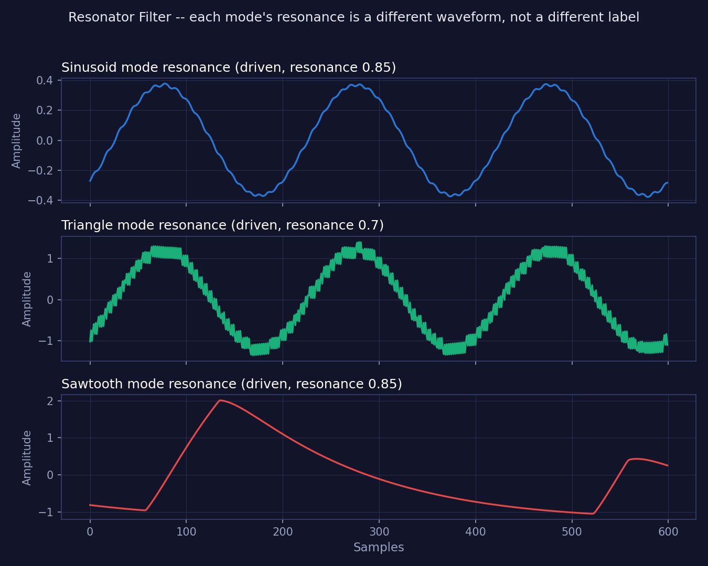
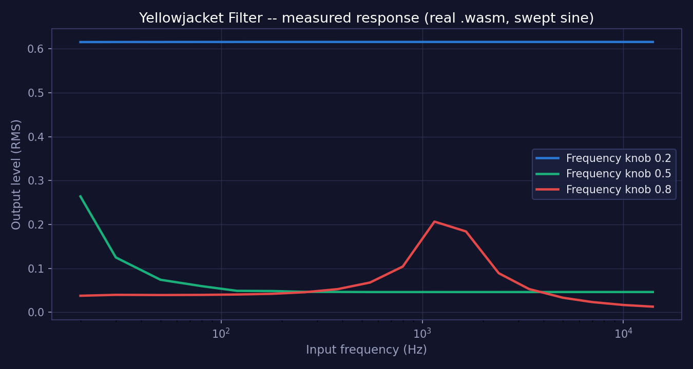

# 🎛️ soemdsp-sandbox

**A browser-based modular audio synthesis sandbox** — patch together native
C++/WASM DSP modules, watch waveforms render live, and hear the result
instantly. No install, no build step, just a Python file server and a
browser.

### 🌐 Live Demo — [soundemote.io/sandbox](http://soundemote.io/sandbox)

---

## ✨ What's inside

- 🔊 **Live Audio** — patch modules together and hear them in real time via
  an AudioWorklet-driven graph.
- 🧩 **Native DSP modules** — oscillators, filters, envelopes, reverbs, and
  chaos generators compiled from C++ to WASM.
- 📈 **Render Sample** — bounce a patch to audio and inspect the waveform.
- 🔌 **CLAP host prototype** — a localhost companion that can probe and host
  real CLAP plugins inside the sandbox graph.

---

## 🚀 Quick start

```powershell
# Requirements: Python 3, a modern browser. No package install needed.

git clone https://github.com/soundemote/soemdsp-sandbox.git
cd soemdsp-sandbox

python server.py
# open http://127.0.0.1:8765

python scripts\smoke_test.py
```

<details>
<summary>⚙️ Optional artifact packet</summary>

```powershell
# Use this only if the sibling soemdsp repo is built locally.
C:\Users\argit\Documents\_PROGRAMMING\soemdsp\build-moved\examples\Debug\runtime_dsp_object_bound_wav_resync_demo.exe
python server.py
```

</details>

<details>
<summary>🎚️ Optional CLAP host prototype</summary>

```powershell
# Localhost companion prototype for CLAP catalog and instance probes.
# Render Sample has a bounded CLAP bridge.
# Feedback touching CLAP nodes and Live Audio CLAP plans are blocked for now.
python tools\webui-clap-host\webui_clap_host.py

# Windows launcher, metadata inspection on by default:
tools\webui-clap-host\start_webui_clap_host.cmd
tools\webui-clap-host\start_webui_clap_host.ps1

# Optional alternate bind port:
python tools\webui-clap-host\webui_clap_host.py --port 48000
tools\webui-clap-host\start_webui_clap_host.cmd -Port 48000
tools\webui-clap-host\start_webui_clap_host.ps1 -Port 48000

# Optional explicit catalog entry:
python tools\webui-clap-host\webui_clap_host.py --plugin "C:\path\to\plugin.clap"

# Optional native descriptor inspection:
python tools\webui-clap-host\webui_clap_host.py --inspect-metadata

# Optional create/init/destroy probe:
python tools\webui-clap-host\webui_clap_host.py --test-instantiate

# Optional JSON preflight report without starting the server:
python tools\webui-clap-host\webui_clap_host.py --doctor --inspect-metadata

# In the sandbox browser:
# Edit the Host field if the companion is not using http://127.0.0.1:47991.
# Click Copy Host Command if you need the Windows .cmd launcher command.
# Click Connect Local Host.
# Click Diagnostics to read setup counts from the running host.
# Click Refresh Plugins to read the host catalog.
# Add a CLAP Plugin module to store a selected catalog entry.

# Prototype instance API:
# GET /health reports host capabilities.
# GET /health also reports hostConfig: bind host, port, Python executable, scan dirs, explicit plugins, and probe flags.
# GET /diagnostics reports hostConfig, catalog counts, metadata errors, instantiation errors, and missing explicit plugin paths.
# --doctor reports hostConfig, catalog counts, metadata errors, instantiation errors, and missing explicit plugin paths as JSON.
# Capabilities include maxProcessFrames, processBatch, and offlineRenderSessions.
# Current maxProcessFrames default is 48000.
# POST /instances
# GET /instances
# GET /instances/<id>/params
# POST /instances/<id>/param
# POST /instances/<id>/params
# GET /instances/<id>/editor
# POST /instances/<id>/editor/open
# POST /instances/<id>/editor/close
# GET /instances/<id>/latency
# GET /instances/<id>/tail
# GET /instances/<id>/state
# POST /instances/<id>/state
# POST /instances/<id>/render/begin
# POST /instances/<id>/process
# POST /instances/<id>/render/end
# POST /process-batch
# /process can accept and return bounded planar-f32-base64 audio.
# /process can apply a parameters array before processing the chunk.
# CLAP_PROCESS_ERROR fails the process call instead of returning audio.
# Direct /param and /params writes are blocked while a render session is active.
# Abandoned render sessions are released by an idle timeout.
# A second render/begin is rejected while a non-idle render session is active.
# Render Sample opens one render session per CLAP instance, processes chunks, then closes the session.
# Render Sample requires audioProcessing: true from the host.
# Render Sample requires offlineRenderSessions: true from the host.
# Render Sample uses maxProcessFrames for CLAP process chunk size.
# WebUI CLAP audio lanes flatten every CLAP audio port in host port order.
# CLAP editor status can be detected; supported Win32 clap.gui editors can open when the plugin accepts the GUI sequence.
# CLAP latency is compensated when Render Sample injects returned CLAP output.
# Finite CLAP tails can extend Render Sample up to the bounded tail limit; infinite tails remain metadata-only.
# CLAP state can be saved into patch JSON and restored into a new host instance when the plugin exposes clap.state.
# Reachable CLAP nodes are processed chunk-by-chunk in graph order.
# Independent CLAP nodes in the same chunk can share one batch request.
# POST /instances/<id>/safety/reset
# DELETE /instances/<id>
```

</details>

---

## 🎚️ Analog filters research

Ported over from the [Analog Filters](https://github.com/elanhickler/soemdsp-sandbox-analog-filters)
fork — modeling the *circuit*, not the sound, so the self-oscillating,
saturating personality of classic analog filters falls out on its own.

Every classic analog filter is a physical accident wearing a transfer
function. Resistors, capacitors, and transistors doing exactly what physics
demands of them — and what physics demands turns out to sound *incredible*
under stress: self-oscillating resonance, soft-clipping feedback loops,
component drift, asymmetric distortion on the way into saturation. None of
that is a bug. It's the entire reason a Moog ladder filter has a personality
and a textbook biquad doesn't.

### 🧪 What makes them hard to get right in software

A naive digital filter is linear, time-invariant, and stable by construction.
A real analog filter is often none of those things, which is exactly what's
being chased here:

- **Nonlinearity.** Real transistor ladder stages saturate. A textbook
  digital filter doesn't, unless you deliberately put a nonlinearity back in
  — and where you put it changes the sound completely.
- **Self-oscillating resonance.** Push feedback gain high enough on a real
  Moog ladder and it turns into an oscillator, cleanly, on purpose. Getting
  a digital model to do the same without exploding numerically is the whole
  game.
- **Zero-delay feedback.** Naive digital translations of analog feedback
  loops introduce a one-sample delay that isn't in the real circuit, which
  audibly changes the resonant behavior. Topology-preserving transform (TPT)
  / zero-delay-feedback (ZDF) techniques exist specifically to close that gap.
- **Frequency-dependent nonlinear behavior.** Saturating a signal *before*
  filtering it sounds different from saturating *after* — and real circuits
  often do both, in a loop, simultaneously. That interaction is where a lot
  of the "expensive analog gear" character actually lives.
- **Aliasing from the nonlinear stages.** Any saturation stage generates
  harmonics; without oversampling, those harmonics fold back down as
  aliasing. Getting the nonlinear modeling right and getting the aliasing
  under control are two separate problems that have to be solved together.

### 🌸 The Flower Child family

Ported from an older `soemdsp` codebase (`FlowerChildFilterCore.h`) —
resonant, self-oscillating feedback designs, not passive filters in the
textbook sense. Each is a native C++/WASM module, verified against the real
compiled artifact with a Python+wasmtime harness before wiring:

| Module | Modes | Notes |
|---|---|---|
| `flower_child_filter` | Clean, Dirty, Rev3, Downsampled | The original two revisions plus an ellipsoid-oscillator variant and a sample-and-hold aliasing variant |
| `rsmet_filter` | LP6/12/18/24, HP6/12/18/24, BP6, BP12 (10) | A ladder filter with a tanh soft clipper and noise injection stage |
| `yellowjacket_filter` | — | Feedback ellipse-oscillator filter, grindy, easily produces square-wave-like output. Its resonance has a chaotic, bubbly character reminiscent of a Polivoks-style filter |
| `superlove_filter` | LP18, LP24, HP6, BP6 | Trisaw-oscillator feedback resonator, warm and stably self-oscillating |
| `chaotic_phase_locking_filter` | — | Direct feedback ellipse-waveshaper resonator (no oscillator phasor) |
| `resonator_filter` | Sinusoid, Triangle, Sawtooth | Dual-phasor FM feedback resonator — each mode's *resonance itself* is visibly and audibly shaped like its namesake, not just a generic buzz with a different label. See below |
| `human_filter` 🚧 | BP6, LP6, LP12 | Dual-phasor feedback network shaped by a bell filter — marked under construction; the original's feedback-filter wrapper (Q, center frequency) wasn't recoverable from the accessible codebase, so a documented Q=1/1kHz default stands in |

Every shaping curve in these (resonance-vs-frequency, FM/PM crossfade, etc.)
is reproduced from the real `soemdsp::utility::Graph` /
`soemdsp::curve::Rational` source, not approximated — a generic N-node graph
evaluator was built once and reused across all of them.

**What makes Flower Child Filter itself interesting:** its Dirty/Rev3-style
oscillators don't crossfade between a sine and a square wave with two
separate waveshapers — they use one continuous
[`ellipse()`](https://github.com/soundemote/oldcode/blob/main/old%20stuff%20se_framework/SynthesizerComponents/oscillator/waveshapes.cpp)
function that morphs a sine into a square (and everywhere in between) as a
single parameter moves, driven directly by resonance. That's the actual
mechanism behind why turning resonance from clean to hot doesn't feel like
switching between two different sounds — it's one continuous, stable
waveshape sweep behind the feedback loop, which is exactly why it sounds and
behaves like a real overdriven self-oscillating filter rather than a
digital effect being crossfaded in.

**SuperLove's HP6 mode in particular** screams — driven hard, it produces
clean, beautiful square waves and is generally one of the hottest-sounding
highpass filters in this set.

**Resonator Filter deserves more than "dual-phasor FM feedback resonator."**
What actually makes it interesting is that each of its three modes doesn't
just change the *timbre* of the resonance — it visibly reshapes what the
resonance *is*:

- **Sawtooth mode's** resonance is literally sawtooth-shaped when you look
  at the waveform, not just "a buzzier tone."
- **Triangle mode's** resonance is literally triangular — a different
  geometric shape entirely, not a filtered version of the same shape.
- **Sinusoid mode's** resonance looks like an overly rounded sine wave, and
  that rounding is exactly why it sounds bubbly rather than smooth — a kind
  of sinusoidal fractal quality that comes directly from the shape, not from
  added modulation.

That's a genuinely novel result for a feedback resonator: the *shape* of the
self-oscillation is the mode, not a label on top of the same underlying
waveform. Measured directly from the real compiled `.wasm` (driven with a
220Hz tone at resonance 0.7–0.85, steady state):

<div align="center">

</div>

### 📈 Characterizing behavior empirically

Here's the thing that makes this whole family hard to reason about from the
code alone: **they're feedback oscillators, not fixed filters.** A plain
lowpass has one transfer function you can write down. These don't — the
"curve" depends on resonance, input level, and the knob position feeds back
into the oscillator's own pitch. There's no formula to graph.

So instead of guessing, the plan is to *measure*: feed a compiled module a
swept sine tone through the same Python+wasmtime harness already used to
verify it, record output RMS per frequency, and plot the result. This turns
"what does turning this knob actually do" from a guess into a chart.

**First result, `yellowjacket_filter`** (see the module's own naming
confusion first — `Yellowjacket_BP` in the original code, but the filter
tap it actually uses is `LP_6`, a lowpass): swept a sine tone from 20Hz to
14kHz through the compiled `.wasm` at three Frequency-knob settings,
resonance fixed at 0.3:

- **Knob 0.2** — flat response (~0.616 RMS) across the whole sweep. The
  self-oscillation is loud enough to drown out whatever's coming in; the
  input frequency barely matters.
- **Knob 0.5** — behaves like an actual lowpass: loud below ~100Hz, settling
  to ~0.046 above ~400Hz.
- **Knob 0.8** — a genuine resonant peak around 1.2–1.6kHz (~0.21 RMS,
  roughly double its neighbors), falling off on both sides.

<div align="center">

</div>

That last point is the answer to "but it sounds like a bandpass in use" —
it does, and now there's a measurement showing exactly where and how much.
The lesson generalizes: for this whole family, "what's the filter curve"
only has an honest answer as a measured, knob-position-dependent chart, not
a static formula — and that's the method to reach for on the rest of the
list below as they get built.

### 🎚️ Filters on the list

| Filter | Status |
|---|---|
| **Moog Ladder** (4-pole transistor ladder, self-oscillating resonance) | 🔲 not started |
| **Diode Ladder** (TB-303-style, asymmetric diode nonlinearity) | 🔲 not started |
| **Sallen-Key** (2-pole op-amp topology, gentler slope) | 🔲 not started |
| **State-Variable Filter** (simultaneous LP/HP/BP/notch outputs) | 🔲 not started |
| **Twin-T Notch** (passive notch, the basis of classic phaser/wah circuits) | 🔲 not started |
| **Discrete Multimode Filter** (parallel 24dB LP / 24dB HP / 12dB BP / 12dB notch outputs, resonance from a feedback loop with an insert point in the path) | 🔲 not started |
| **Simultaneous LP/HP Filter** (one core filter stage driven as a 12dB lowpass and a separate highpass at once, each with its own audio input and level control, prized for a screaming self-oscillating character) | 🔲 not started |
| **Switchable Third-Order Filter** (three cascaded first-order sections, each switchable between lowpass and highpass, a mode switch selecting among four low-pass/band-pass/reversed-band-pass/high-pass combinations, and a voltage-controlled resonance amplifier that can be driven well past the onset of oscillation into chaotic and phase-locked territory, with taps available after each of the three stages) | 🔲 not started |
| **Diode-Controlled LP/HP Pair** (a highpass stage tracking at half rate paired with a lowpass stage tracking at full rate to form a bandpass-like sweep, with frequency set by diode control current rather than a transistor or OTA stage — which naturally narrows the usable sweep range — and matched capacitor pairs tuning the corner behavior) | 🔲 not started |

This table is the honest state of things: a target list, not a changelog.
Each filter gets the same treatment already proven out elsewhere in
`soemdsp-sandbox` — native C++ compiled to WASM, verified against the real
compiled artifact (not just a JS mirror) before it's wired into the graph.

### 🎧 Listen & watch

*(Placeholder links below — real recordings and demo videos go here once
they exist.)*

| Filter | Audio example | Video demo |
|---|---|---|
| Moog Ladder | [File — TBD](https://drive.google.com/drive/folders/REPLACE_ME_MOOG_LADDER_AUDIO) | [Video — TBD](https://youtube.com/watch?v=REPLACE_ME_MOOG_LADDER_DEMO) |
| Diode Ladder | [File — TBD](https://drive.google.com/drive/folders/REPLACE_ME_DIODE_LADDER_AUDIO) | [Video — TBD](https://youtube.com/watch?v=REPLACE_ME_DIODE_LADDER_DEMO) |
| Sallen-Key | [File — TBD](https://drive.google.com/drive/folders/REPLACE_ME_SALLEN_KEY_AUDIO) | [Video — TBD](https://youtube.com/watch?v=REPLACE_ME_SALLEN_KEY_DEMO) |
| State-Variable Filter | [File — TBD](https://drive.google.com/drive/folders/REPLACE_ME_SVF_AUDIO) | [Video — TBD](https://youtube.com/watch?v=REPLACE_ME_SVF_DEMO) |
| Twin-T Notch | [File — TBD](https://drive.google.com/drive/folders/REPLACE_ME_TWIN_T_AUDIO) | [Video — TBD](https://youtube.com/watch?v=REPLACE_ME_TWIN_T_DEMO) |
| Discrete Multimode Filter | [File — clean filter, hot growl](https://drive.google.com/file/d/1E3-sMArwa7t_eC6wMtEOVAn5BaVc_leS/view?usp=drive_link) | [Video — TBD](https://youtube.com/watch?v=REPLACE_ME_DISCRETE_MULTIMODE_DEMO) |
| Simultaneous LP/HP Filter | [File — audio demo](https://drive.google.com/file/d/1v6cj6S2RXMOlhOBtbkLipTRUmtfrA46H/view?usp=drive_link) | [Video — TBD](https://youtube.com/watch?v=REPLACE_ME_SIMULTANEOUS_LPHP_DEMO) |
| Switchable Third-Order Filter | [Demo 1](https://drive.google.com/file/d/1bhXlDZkRRuVh6U2f-yfDGbNIiGXiXShG/view?usp=drive_link) · [Demo 2](https://drive.google.com/file/d/1n_9JrZ-zFQ6GQ_a3WGlaKEBpWaulGuDD/view?usp=drive_link) · [Demo 3](https://drive.google.com/file/d/17c3guemmtnHMpqAFP10LeAs0udspJS4r/view?usp=drive_link) · [Demo 4](https://drive.google.com/file/d/1qEJnqQwlNJC80FcRapuWH1bSFhWHdRDQ/view?usp=drive_link) | [Video — TBD](https://youtube.com/watch?v=REPLACE_ME_SWITCHABLE_THIRD_ORDER_DEMO) |
| Diode-Controlled LP/HP Pair | [File — audio demo](https://drive.google.com/file/d/1fkqbuZDtS1OKaCmWBK-u9vtAbCAzDxhS/view?usp=drive_link) | [Video — TBD](https://youtube.com/watch?v=REPLACE_ME_DIODE_CONTROLLED_LPHP_DEMO) |

---

## 🍴 Featured forks & experiments

Themed sandbox forks exploring specific DSP ideas — each one a self-contained
detour worth a look:

| Fork | What makes it worth a click |
|---|---|
| 🌊 [**Aliasing Wars**](https://github.com/elanhickler/soemdsp-sandbox-aliasing-wars) | Anti-aliases a hard-sync oscillator with reused PolyBLEP and sub-sample sync timing, proven out via a 27-assertion WASM test harness. |
| 💡 [**Vactrols**](https://github.com/elanhickler/soemdsp-sandbox-vactrols) | Grounds the vactrol envelope modules in real photoconductor physics, backed by actual recordings of hardware vactrols under CV control. |
| 🔢 [**Digital Signals**](https://github.com/elanhickler/soemdsp-sandbox-digital-signals-audio) | Asks what happens if patch wires carry packed bits instead of a continuous voltage — down to an FPGA-inspired LUT Cell module. |
| 📺 [**Phosphor**](https://github.com/elanhickler/soemdsp-sandbox-phosphor) | Rebuilds the scope renderers on real CRT-phosphor decay physics, with a hand-curated gallery of oscilloscope glow references. |
| ⚡ [**Digital Efficient Patch System**](https://github.com/elanhickler/soemdsp-sandbox-digital-efficient-patch-system) | Chases real-time multiplayer patch editing, with a brutally honest, phase-by-phase log of profiling dead ends before finding the actual bottleneck. |
| 🐾 [**Creatures**](https://github.com/elanhickler/soemdsp-sandbox-creatures) | A patchable virtual pet that eats your audio signal and reacts with eight moods, from Peaceful to Meltdown on a harsh clipped signal. |
| 🎚️ [**Analog Filters**](https://github.com/elanhickler/soemdsp-sandbox-analog-filters) | Models classic analog filter circuits (Moog ladder, ZDF/TPT feedback) closely enough that their self-oscillating, saturating personality falls out for free. |
| 🧵 [**SIMD**](https://github.com/elanhickler/soemdsp-simd) *(in progress)* | A methodical dig into the parameter/smoothing architecture, landing measured wins like a 1.5x faster reverb from skipping settled-parameter recomputation. |

---

## 📄 License

This repository is source-available for noncommercial use only. Commercial
use requires a separate written commercial license from Soundemote. See
[`LICENSE`](LICENSE).

---

## 📚 Guides

- [`docs/ADDING_HARDCODED_SANDBOX_MODULE.md`](docs/ADDING_HARDCODED_SANDBOX_MODULE.md)
- [`docs/OSC_MODULE_NON_UI_REFERENCE.md`](docs/OSC_MODULE_NON_UI_REFERENCE.md)
- [`docs/WEBUI_CLAP_HOST_PLAN.md`](docs/WEBUI_CLAP_HOST_PLAN.md)
- [`tools/webui-clap-host/README.md`](tools/webui-clap-host/README.md)

## 🧭 Boundaries

- The server only writes through explicit save/settings/audio helper routes.
- Open Path is restricted to Downloads.
- The browser patch graph is demo-scoped state.
- The browser compiler is not the production soemdsp scheduler.
- The WebUI does not instantiate real C++ DSP objects yet.
- Patch files can save current module instances and settings.
- Patch files cannot define new module types by themselves.
