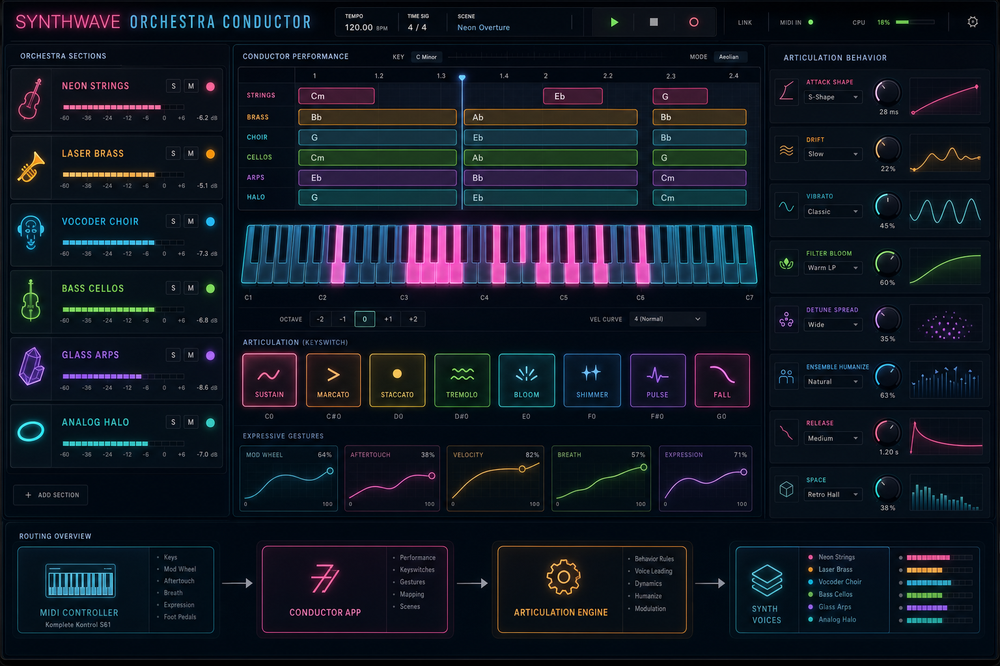

# 🌆 supersaw

**A `soemdsp-sandbox` fork dedicated to supersaw research** — forked from the
[`aliasing-wars`](https://github.com/elanhickler/soemdsp-sandbox-aliasing-wars)
mission, on a new `supersaw` branch, in its own dedicated repo:
[`elanhickler/supersaw`](https://github.com/elanhickler/supersaw).

Where `aliasing-wars` studies alias-free single-oscillator techniques
(PolyBLEP, DSF), this branch zooms out to the classic "wall of detuned saws"
sound — and to a specific, unusually elegant answer to the aliasing question
that a *stack* of oscillators raises: **pitch dithering**, from Robin
Schmidt's [RS-MET](https://github.com/RobinSchmidt/RS-MET) project.

---

## 🎻 Why a supersaw needs its own aliasing story

A single bandlimited sawtooth is a solved problem — that's what
`aliasing-wars` is about. A **supersaw** stacks a whole *choir* of them (7,
15, 31, up to 63 in Soundemote's own implementation), each detuned by a few
cents, each drifting slightly in pitch and phase over time to imitate the
micro-variation of a real string or synth-choir section. That multiplies the
aliasing-mitigation problem by the oscillator count — and multiplies the
*cost* of naive fixes (oversampling scales linearly with voice count; BLEP
tables get expensive fast at 63 simultaneous edges per sample).

Robin Schmidt's answer sidesteps the cost question entirely with a different
trick: **don't correct the aliasing — replace it with noise you'd rather
have.**

## 🎲 Pitch Dithering — RobinSchmidt/RS-MET

- Repo: [RobinSchmidt/RS-MET](https://github.com/RobinSchmidt/RS-MET)
- Author's page: [soundemote.io/robinschmidt](https://soundemote.io/robinschmidt)
- Write-up: [`Notes/Scratch/PitchDithering.md`](https://github.com/RobinSchmidt/RS-MET/blob/work/Notes/Scratch/PitchDithering.md)
- Implementation: [`PitchDitherOscs.h`](https://github.com/RobinSchmidt/RS-MET/blob/work/Libraries/RobsJuceModules/rapt/Generators/PitchDitherOscs.h) / [`PitchDitherOscs.cpp`](https://github.com/RobinSchmidt/RS-MET/blob/work/Libraries/RobsJuceModules/rapt/Generators/PitchDitherOscs.cpp)

The core observation: a digital sawtooth is genuinely alias-free — no
correction needed at all — whenever its cycle length happens to land on an
**exact integer number of samples**. The catch is obvious: only a discrete
set of frequencies satisfy that, and rounding every requested pitch to the
nearest one would mistune everything, worse at higher pitches.

**Pitch dithering's move:** don't round to *one* integer cycle length —
*probabilistically alternate* between integer cycle lengths so that the
*average* comes out exactly right. If the true desired cycle length is
`c = 100.3` samples, alternate between 100-sample and 101-sample cycles
with probabilities `0.7` / `0.3` — the long-run average length is exactly
`100.3`, and every individual cycle rendered is alias-free by construction
(integer length ⇒ no aliasing, just harmonic amplitude reshuffling).

The naive version of this idea has one flaw: the *amount* of resulting
noise depends on how close the desired length is to an integer. Exactly on
an integer → zero noise. Exactly halfway between two integers (`c = xxx.5`)
→ maximum noise. That inconsistency would make the oscillator's character
shift audibly as you play different notes. RS-MET's refinement — the
**3-cycle-length scheme** in `rsPitchDitherOsc` (`c₁ = c₂ − 1`, `c₂`, `c₃ = c₂ + 1`,
each with its own probability) — is specifically constructed so the
*variance* of the injected noise stays constant regardless of how close `c`
is to an integer. The trade of "aliasing artifacts" for "a small, constant,
pitch-independent noise floor" is the whole idea, and — per the write-up —
it survives waveshaping: since the underlying phasor is what's dithered,
not the final waveform, any shape you build on top of that phasor (saw,
square, or an arbitrary waveshaper) inherits the same alias-free property
for free.

This is a genuinely different philosophy from `aliasing-wars`'s other two
techniques:

| Technique | Idea |
|---|---|
| PolyBLEP (`aliasing-wars`) | Correct the edge, right after it happens |
| DSF (`aliasing-wars`) | Never create the edge — build the waveform from a closed-form harmonic sum |
| Pitch dithering (here) | Let the edge be exactly periodic every single cycle, and hide the pitch error in noise instead of in the spectrum |

For a supersaw specifically, this matters because the cost of pitch
dithering per voice is trivial (an integer-cycle-length phasor plus a tiny
RNG draw), so it scales to dozens of simultaneous detuned voices in a way
that oversampling or per-voice BLEP tables can't match as cheaply.

---

## 🎹 Soundemote's own Supersaw

Alongside RS-MET's research, Soundemote has its own production supersaw
architecture, `SupersawUnit` / `SupersawMaster` — reference copy checked
into [`docs/reference/Supersaw.hpp`](docs/reference/Supersaw.hpp) (and its
sibling, [`docs/reference/Hypersaw.hpp`](docs/reference/Hypersaw.hpp)) —
built on top of `soemdsp`'s `PolyBLEP` oscillator and RS-MET's `RAPT`
library (bundled under `soemdsp/libs/RSMET`, via `RatioGenerator.h` and
`ArrayTools.h`). This is the "real instrument" layer that a pitch-dithered
or DSF-based unison voice would eventually slot into.

Structurally, `SupersawMaster` drives up to **63** `SupersawUnit` voices,
each one a `PolyBLEP` oscillator plus its own envelope, drift generator,
and vibrato feed. What makes it sound like an *instrument* rather than a
wall of identical detuned saws is the amount of per-voice variation on top:

- **Six detune algorithms** (`Classic`, `Realistic`, `Emotional`, `Chordal`,
  `Linear`, `Exponential`), each a different ratio table generated via
  RS-MET's `RAPT::rsRatioGenerator` (`primePower`, `primePowerDiff`, and
  `linToExp` ratio kinds) — different mathematical relationships between
  voices produce audibly different characters, from "classic" even
  detuning to "chordal" ratios that lean toward consonant intervals.
- **Per-voice drift** — a `FlexibleRandomWalk` nudging each voice's pitch
  independently over time, for the slow, organic wobble a real unison
  section has that a static detune spread doesn't.
- **Vibrato**, switchable **per-voice or per-oscillator** — either the
  whole stack breathes together, or each voice gets its own independent
  vibrato phase and rate for a much wider, less synchronized chorus.
- **Randomized per-voice envelopes** — delay, attack, and release times are
  each drawn per voice on every note-on (`triggerAttack()`), so voices
  don't all fade in and out in lockstep.
- **Phase reset modes** (`Never` / `Legato` / `Always`) and **portamento**
  with a continuously variable linear-to-exponential curve
  (`portamentoStyle_`), plus a **pitch-compensation** curve that scales how
  much drift/vibrato bends pitch as a function of the note's absolute pitch
  (more movement is more audible — and more useful — in different registers).
- **Center/side stereo crossfade** (`getCenterSideAmplitudeValue`) — blends
  between "everything mixed to a fat mono center" and "spread hard across
  the stereo field," rather than a single fixed unison-width knob.

---

## 🌌 The Synthwave Orchestra

The reason this branch bundles both an anti-aliasing research thread *and*
a production supersaw architecture is a specific, larger ambition:
Soundemote's plan for a **Synthwave Orchestra** — an instrument that fuses
the analog-synth unison stack (supersaws, arpeggiated sequences, glowing
pads) with a full orchestral palette (strings, brass, choir), aimed at that
retro-futurist "80s synth score meets real orchestra" sound.

Getting a supersaw stack that sits *convincingly* next to real orchestral
samples — without either sounding harshly aliased under heavy detune, or
requiring so much oversampling that a 63-voice-per-note instrument becomes
unplayable in real time — is exactly the intersection this branch exists to
work out: RS-MET's pitch dithering for cheap, alias-free density at scale,
and Soundemote's existing `Supersaw`/`Hypersaw` voice architecture for the
musical character on top of it.

---

## 🌀 Hypersaw

A sibling voice architecture to Supersaw (reference copy:
[`docs/reference/Hypersaw.hpp`](docs/reference/Hypersaw.hpp)) — a phase-modulated
bank of sawtooths where every voice is kept confined to a small band of
phases, rather than allowed to drift or randomize freely across the full
cycle. Letting detuned saws roam into arbitrary, uncorrelated phase
relationships is exactly what produces unwanted flanging and phasing as
their relative offsets sweep in and out of alignment — Hypersaw sidesteps
that by design, keeping the phase spread narrow enough that voices stay
in a stable relationship to one another.

📄 Dedicated write-up: *link coming soon*

---

## 🎼 Additive supersaw (research idea, not yet implemented)

A third, distinct approach worth tracking alongside pitch dithering and
Hypersaw's phase-banding: build the sawtooth **additively** — as an
explicit sum of sine harmonics up to Nyquist — and inject independent
**noise modulation on each harmonic** (small, decorrelated jitter in each
partial's phase and/or amplitude) rather than on the fundamental or the
phase relationship between voices.

This targets the same underlying complaint pitch dithering and Hypersaw
each address in their own way — a supersaw stack that sounds too static,
too perfectly aligned, or harshly beating as voices drift in and out of
phase — but from a different domain entirely. Pitch dithering randomizes
the *fundamental's timing*; Hypersaw constrains the *phase relationship
between voices*; this idea randomizes *each harmonic independently*
within a single additive voice. The result, if it works as intended,
would be a softer, more dispersed, less "laser-etched" character to the
individual sawtooth itself — closer to how a real unison section's
micro-variation lives in the fine spectral detail of each note, not just
in its pitch or its stereo phase spread.

Open questions before this becomes a real module: how much per-harmonic
noise depth is possible before the result stops reading as "a sawtooth"
at all, and whether an explicit oscillator-per-harmonic bank (up to
`Nyquist / frequency` oscillators per voice) is cheap enough to run
per-voice across a 63-voice supersaw stack in real time.

## License

This repository is source-available for noncommercial use only. Commercial use
requires a separate written commercial license from Soundemote. See
[`LICENSE`](LICENSE).
